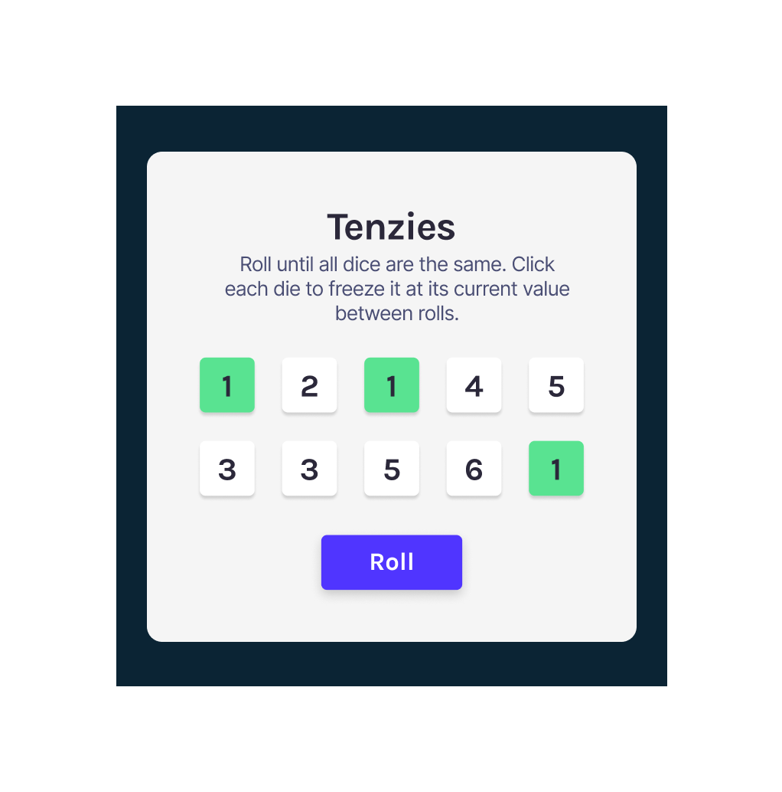

The following projects are the results of my learning of Reactjs, all credits go to the course: https://www.youtube.com/watch?v=bMknfKXIFA8

I guaranteed that these projects are not copy and paste, I had fully commited and following closely to the teachings of the maker of the course. I did not think up of these projects myself but thanks to the guidance of him that I was able to learn alot and build functional web pages.

I will show demo pictures of the webs below:

1. Static React Information page
   

2. Static portfolio page (I definitely replace the girl picture with my own, the following is only a demo of my code)
   

3. Airbnb basic clone
   

4. My travel journal
   

5. Meme generator
   

6. Basic notes app
   

7. Tenzies game
   

8. Quizzical App
   
